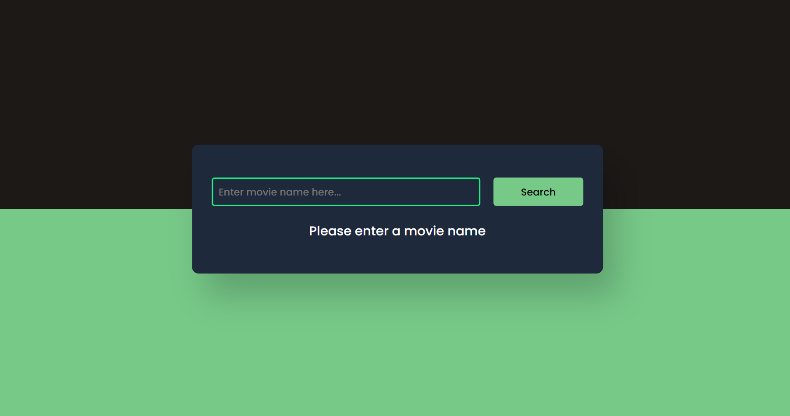
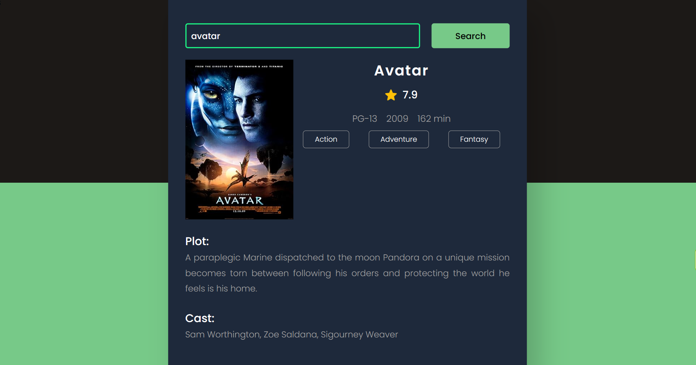

# Movie Recommender JS

Movie Recommender JS is an interactive web interface designed to help users search for movie reviews online. Powered by HTML, CSS, JavaScript, and the OMDb API, this project provides a seamless experience for finding information about movies.

## Features

- **Search Functionality**: Easily search for movies by title.
- **Dynamic Results**: Instantly see movie information and reviews without refreshing the page.
- **Responsive Design**: The interface is optimized for various screen sizes, ensuring a consistent experience across devices.
- **Interactive**: Engage with movie details including ratings, plot summaries, and more.
- **Easy to Use**: Simple and intuitive interface for users of all levels.

## Screenshots

### Without Search Query

### With Search Query (e.g., "Avatar" movie)

## How to Use

1. Clone the repository to your local machine.
2. Open the `index.html` file in your web browser.
3. Enter the title of the movie you want to search for in the provided input field.
4. Press the search button to see the movie details and reviews.

## Technologies Used

- **HTML**: Used for structuring the web page.
- **CSS**: Used for styling and layout.
- **JavaScript**: Used for dynamic interactions and API calls.
- **OMDb API**: Integrated to fetch movie data and reviews.
